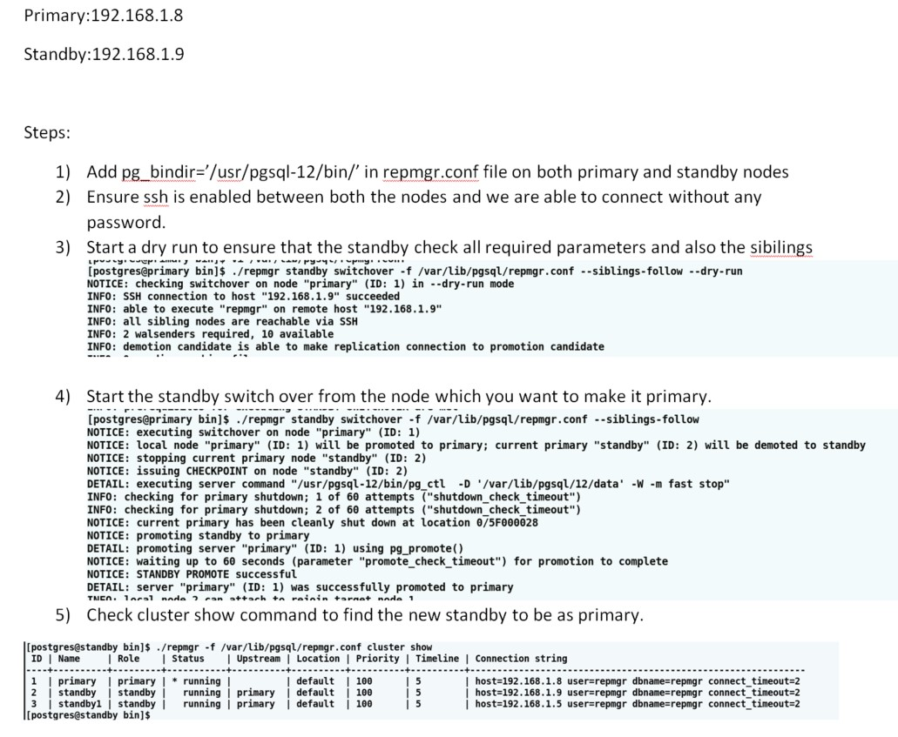

- Go to standby and run the command below
```
./repmgr standby switchover -f /var/lib/pgsql/repmgr.conf --siblings-follow --dry-run
Note - siblings-follow used if you have another standby that needs to follow new primary after switchover
./repmgr standby switchover -f /var/lib/pgsql/repmgr.conf --siblings-follow (actual run)
./repmgr -f /var/lib/pgsql/repmgr.conf cluster show
```
- After completion of maintenance on old primary, do the switchover on that server
```
./repmgr standby switchover -f /var/lib/pgsql/repmgr.conf --siblings-follow --dry-run
./repmgr standby switchover -f /var/lib/pgsql/repmgr.conf --siblings-follow (actual run)
./repmgr -f /var/lib/pgsql/repmgr.conf cluster show
```

