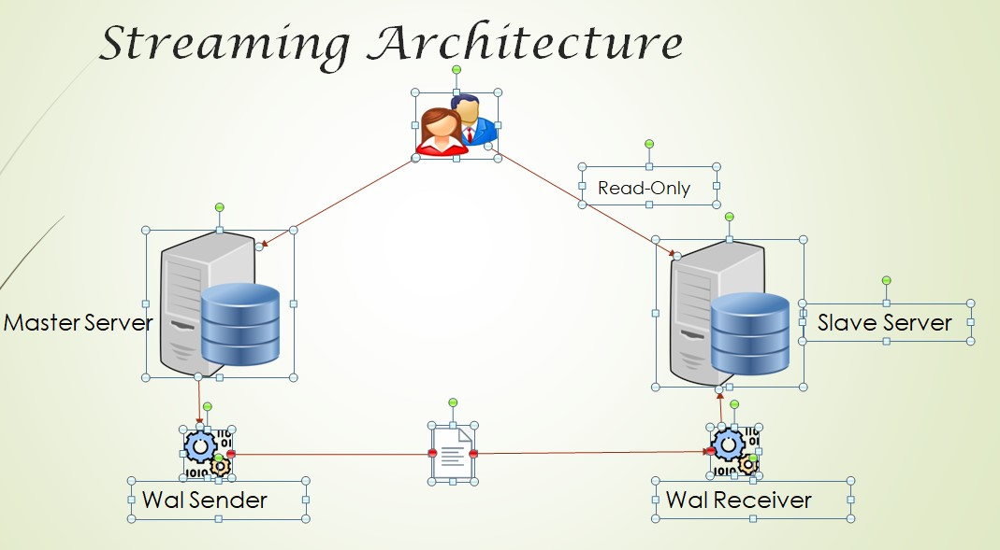

#Overview
- WAL record chunks are streamed by database servers to keep data in sync.
- The standby server connects to the master to receive the WAL chunks.
- The WAL records are streamed as they are generated.
- The streaming of WAL records need not wait for the WAL file to be filled.
- This allows a standby server to stay more up-to-date than is possible with file-based log shipping.
- By default, streaming replication is asynchronous even though it also supports synchronous replication.

```
Master----> wal sender -------------------wal records------------------wal receiver-----> Slave server
```
