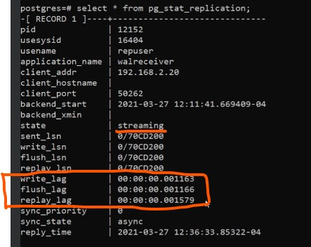

## PG STAT REPLCIATION VIEW is the golden source
```
Pg_stat_replication view (primary server)
    pid:              Process id of walsender process
   usesysid:         OID of user which is used for Streaming replication.
   usename:          Name of user which is used for Streaming replication
   application_name: Application name connected to Primary
   client_addr:      Address of standby/streaming replication
   client_hostname:  Hostname of standby.
   client_port:      TCP port number on which standby communicating with WAL sender
   backend_start:    Start time when SR connected to Primary.
   state:            Current WAL sender state i.e streaming
   sent_location:    Last transaction location sent to standby.
   write_location:   Last transaction written on disk at standby
   flush_location:   Last transaction flush on disk at standby.
   replay_location:  Last transaction flush on disk at standby.
   sync_priority:    Priority of standby server being chosen as synchronous standby
   sync_state:       Sync State of standby (is it async or synchronous).
```

- Function to check whether standby is in recovery mode or not.
  ```
       Select pg_is_in_recovery();
  ```
- Find current LSN in master server
```
      select * from pg_current_wal_lsn();
      pg_current_wal_lsn|0/7212A20
```
- Get last write-ahead log location received and synced to disk by streaming replication. (Standby).
```
       Select pg_last_wal_receive__lsn();
       pg_last_wal_receive__lsn|0/7212A20
```
# Find the lag between master and standby based on current lsn and last received lsn
```
psql> select * from pg_current_wal_lsn(); On master
pg_current_wal_lsn| 0/B000110
psql> select * from pg_last_wal_receive_lsn(); On standby
pg_last_wal_receive_lsn|0/C0197F8
psql> select pg_wal_lsn_diff('0/B000110','0/C0197F8');
pg_wal_lsn_diff| 67313932 bytes
psql> select round(67313932/pow(1024,2,0),2) missing_in_mb;
missing_in_mb
64.10
```
# Find the physical location of wal file in prod, based on current lsn
```
psql> select pg_walfile_name('0/B000110');
pg_walfile_name|000000000000001000000000c
- The stats related to the incoming replication can be monitored using
```
       Select * FROM pg_stat_wal_receiver;
```
- Get last write-ahead log location replayed during recovery. (Standby)
  ```
       Select pg_last_wal_replay_lsn();
  ```
- Get time stamp of last transaction replayed during recovery. (Standby)
  ```
       Select pg_last_xact_replay_timestamp();
  ```

